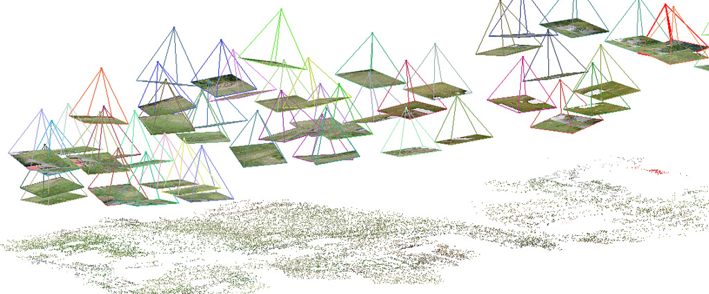
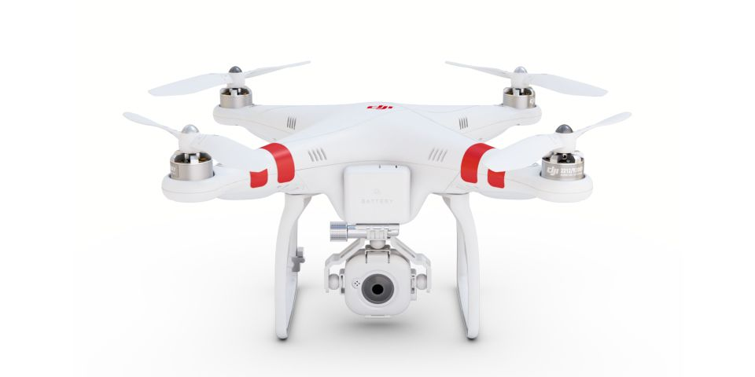
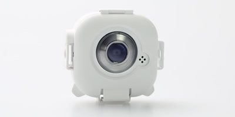
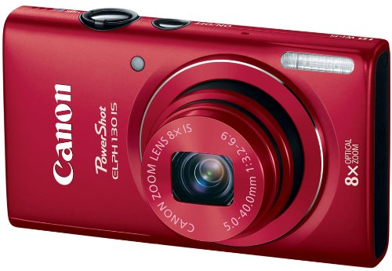
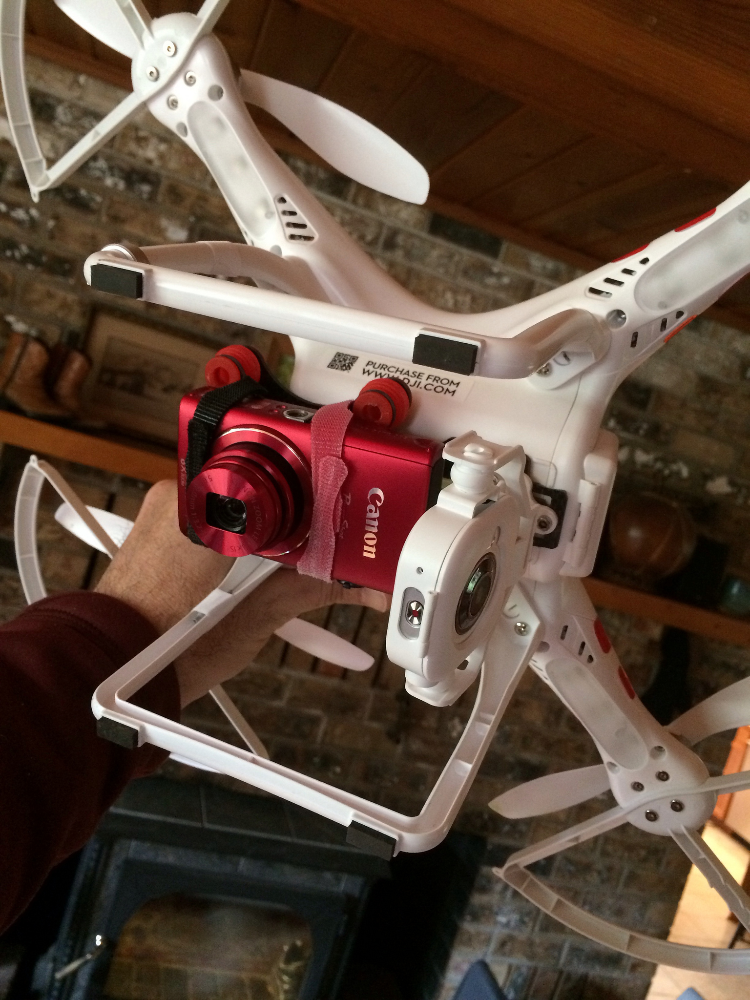

<!------------------------------------------------------------>
<!--      FOSS4G 2014 - Quadcopter GIS on the cheap         -->
<!--      Target talk time - 20 min + 5 min questions       -->
<!------------------------------------------------------------>

<!------------------------------------------------------------>
<!-- Topic: Title slide -->

<h2>Quadcopter GIS for less than $700</h2>
<h4>Hardware/Software to help map your local community</h4>

    <small>Aaron Racicot - <a href="mailto:aaronr@z-pulley.com">aaronr@z-pulley.com</a>
 
<a href="http://reprojected.com">reprojected.com</a> / <a href="http://twitter.com/reprojected">@reprojected</a> 
 
<a href="https://github.com/aaronr">github.com/aaronr</a>
  
<a href="http://aaronr.github.io/foss4g-2014/smalltown">aaronr.github.io/foss4g-2014/quadcopter</a>
</small>

<!------------------------------------------------------------>
--SLIDE--
<!-- Topic: Introduce myself -->

<h1>Who I am?</h1>

<ul>
  <li><strong>SW Developer</strong></li>
  <li><strong>Environmental Scientist</strong></li>
  <li><strong>Open Source Advocate</strong></li>
</ul>

--SUBSLIDE--

  <h3>Computer Science</h3>
  <h2>Bridging the Gap</h2>
  <h3>Environmental Science</h3>

--SUBSLIDE--

<!------------------------------------------------------------>
--SLIDE--
<!-- Topic: Hardware setup ... -->

 
Phantom FC40

--SUBSLIDE--

 
FPV camera (FC40)

--SUBSLIDE--

 
Canon downward facing camera (CHDK)

--SUBSLIDE--

 
"The Rig"

<!------------------------------------------------------------>
--SLIDE--
<!-- Topic: Why is this so interesting now ... -->

Why is this so interesting now...

--SUBSLIDE--

Aaron's Law of Quadcopter Pricing!

--SUBSLIDE--

Technology (Hardware and Software) are becoming so easy to use

--SUBSLIDE--

Fun!!!!!!!!

<!------------------------------------------------------------>
--SLIDE--
<!-- Topic: Is it legal ... -->

Is it legal

--SUBSLIDE--

<iframe width="100%" height="500px" frameBorder="0" src="https://www.mapbox.com/drone/no-fly/#10/45.4818/-122.6658"></iframe>
Where is it OK to fly
 
https://www.mapbox.com/drone/no-fly/

<!------------------------------------------------------------>
--SLIDE--
<!-- Topic: Interesting workflows ... -->

Panoramic image stitching

--SUBSLIDE--

ICE

--SUBSLIDE--

AgiSoft

<!------------------------------------------------------------>
--SLIDE--
<!-- Topic: Interesting workflows ... -->

OSM data creation

--SUBSLIDE--

QGIS Warper

--SUBSLIDE--

MapKnitter
http://mapknitter.org/

--SUBSLIDE--

Edit in OSM
http://ideditor.com/

<!------------------------------------------------------------>
--SLIDE--
<!-- Topic: Interesting workflows ... -->

3D from Structure from Motion (SFM)

--SUBSLIDE--

Visual SFM

--SUBSLIDE--

AgiSoft

<!------------------------------------------------------------>
--SLIDE--
<!-- Topic: Future ... -->

DEMs and optimal accuracy

--SUBSLIDE--

--SUBSLIDE--

<!------------------------------------------------------------>
--SLIDE--
<!-- Topic: Thank You -->

<h1>Thank You !!!</h1>

