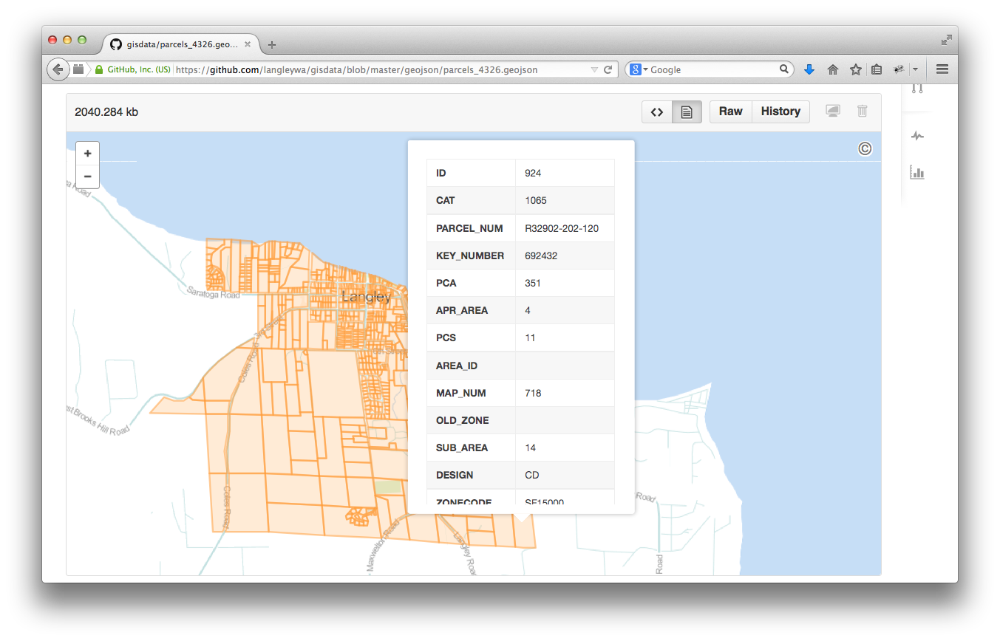
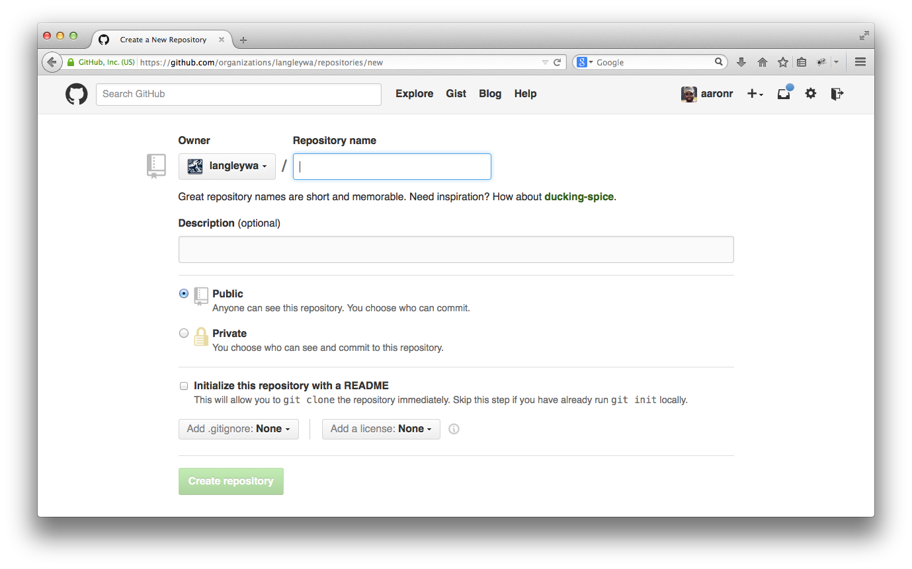
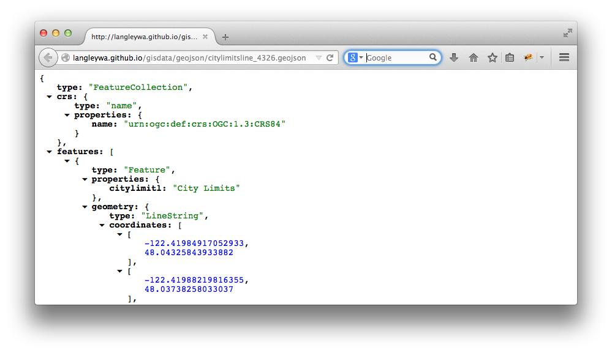

<!------------------------------------------------------------>
<!--      FOSS4G 2014 - Small Town GIS leveraging GitHub    -->
<!--      Target talk time - 20 min + 5 min questions       -->
<!------------------------------------------------------------>

<!------------------------------------------------------------>
<!-- Topic: Title slide -->

<h2>Small Town GIS leveraging GitHub</h2>

    <small>Aaron Racicot - <a href="mailto:aaronr@z-pulley.com">aaronr@z-pulley.com</a>
 
<a href="http://reprojected.com">reprojected.com</a> / <a href="http://twitter.com/reprojected">@reprojected</a> 
 
<a href="https://github.com/aaronr">github.com/aaronr</a>
  
<a href="http://aaronr.github.io/foss4g-2014/smalltown">aaronr.github.io/foss4g-2014/smalltown</a>
</small>

<!------------------------------------------------------------>
--SLIDE--
<!-- Topic: Introduce myself -->

<h1>Who I am?</h1>

<ul>
  <li><strong>SW Developer</strong></li>
  <li><strong>Environmental Scientist</strong></li>
  <li><strong>Open Source Advocate</strong></li>
</ul>

--SUBSLIDE--

  <h3>Computer Science</h3>
  <h2>Bridging the Gap</h2>
  <h3>Environmental Science</h3>

--SUBSLIDE--

<!------------------------------------------------------------>
--SLIDE--
<!-- Topic: Target Audience -->

 
Our "Small Town" - 1000 residents

--SUBSLIDE--

 
Washington State - North of Seattle

--SUBSLIDE--

 
1 Square Mile

<!------------------------------------------------------------>
--SLIDE--
<!-- Topic: How we started -->

<h2>How this started</h2>
Student Internship

--SUBSLIDE--

<h2>Where we want to go</h2>
Partnerships with local Government

<!------------------------------------------------------------>
--SLIDE--
<!-- Topic: Needs -->

<h2>What our small town does not have...</h2>

Money

Resources (People)

Resources (Technology)

--SUBSLIDE--

<h2>What our small town needs...</h2>

Inexpensive solutions

Data normalization

Data access

Simple Applications

<!------------------------------------------------------------>
--SLIDE--
<!-- Topic: GitHub ... -->

 

Version Control (Data and Applications)

Hosting (GitHub Pages)

Open at heart!

Free!!!

--SUBSLIDE--

 
Work in the open... for FREE!

--SUBSLIDE--

 
Leveraging GitHub Pages for hosting!

<!------------------------------------------------------------>
--SLIDE--
<!-- Topic: Geo at GitHub -->

 
Geo at Github

--SUBSLIDE--

 
Preview data

--SUBSLIDE--

 
Diff GeoJSON

<!------------------------------------------------------------>
--SLIDE--
<!-- Topic: Bring the two together -->

<h2>Workflow</h2>

--SUBSLIDE--

 
Add Data

--SUBSLIDE--

 
Preview

--SUBSLIDE--

 
Edit Data (geojson.io)

--SUBSLIDE--

 
Diff Data

--SUBSLIDE--

 
Build Apps!

<!------------------------------------------------------------>
--SLIDE--
<!-- Topic: -->

<h2>Data</h2>
GeoJSON + Tile Sets

--SUBSLIDE--

<h2>GeoJSON</h2>

Convert and reproject to WGS84 lat/lon (EPSG:4326)

<pre><code>
for f in *.shp; do ogr2ogr -f "GeoJSON" -s_srs EPSG:2285 ...
-t_srs EPSG:4326 ${f/.shp}_4326.geojson $f; done
</code></pre>

--SUBSLIDE--

 
Create repo on GitHub

--SUBSLIDE--

<pre><code>
git clone git@github.com:langleywa/gisdata.git
cd gisdata
mv ~/mylayer.geojson .
git add mylayer.geojson
git commit -m "Yes... DATA"
git push
</code></pre>

--SUBSLIDE--

<pre><code>
git checkout -b gh-pages
git push origin gh-pages
</code></pre>

--SUBSLIDE--

http://langleywa.github.io/gisdata/geojson/citylimitsline_4326.geojson
 

<!------------------------------------------------------------>
--SLIDE--
<!-- Topic: -->

<h2>Tile Sets</h2>

--SUBSLIDE--

 
Geo reference your data

--SUBSLIDE--

<pre><code>
nearblack -of GTiff -setalpha -o outfile infile
</code></pre>

--SUBSLIDE--

<pre><code>
gdal2tiles.py --profile=mercator -z 1-22 yourmap.tif outputfolder
</code></pre>

--SUBSLIDE--

<pre><code>
git add outputfolder
git commit -m "Yes... TILE DATA"
git push
</code></pre>

--SUBSLIDE--

<pre><code>
git checkout gh-pages
git merge master
git push origin gh-pages
</code></pre>

--SUBSLIDE--

http://langleywa.github.io/gisdata/tiles/langley-2nd-street-2014/21/335500/1368498.png
 

<!------------------------------------------------------------>
--SLIDE--
<!-- Topic: Examples adding data-->

GeoJson
<pre><code>
var featureLayer = L.mapbox.featureLayer()
    .loadURL('/gisdata/geojson/citylimitsline_4326.geojson')
    .addTo(map);
</code></pre>

--SUBSLIDE--

Tiles
<pre><code>
var tileLayer = L.tileLayer('/gisdata/tiles/langley-2nd-street-2014/{z}/{x}/{y}.png', 
    {tms: true, minZoom:1, maxZoom:22, bounds:bounds}).addTo(map);
</code></pre>

<!------------------------------------------------------------>
--SLIDE--
<!-- Topic: Examples -->

Test App 
<small>http://langleywa.github.io/apps/test/</small>

Example Data URLs 
<small>http://langleywa.github.io/gisdata/geojson/historicinventory_4326.geojson</small>
<small>http://langleywa.github.io/gisdata/tiles/langley-2nd-street-2014/16/10484/42765.png</small>

geojson.io 
<small>http://geojson.io/#id=github:langleywa/gisdata/blob/gh-pages/geojson/historicinventory_4326.geojson&map=19/48.04109/-122.40962</small>

Diff URL 
<small>https://github.com/langleywa/gisdata/commit/9e74d8c5e4d9f906c20e1d4778077e8578d58d1c?short_path=e5eee6f#diff-e5eee6f691fac526315233e6a5fcf251</small>

<!------------------------------------------------------------>
--SLIDE--
<!-- Topic: Thank You -->

<h1>Thank You !!!</h1>
