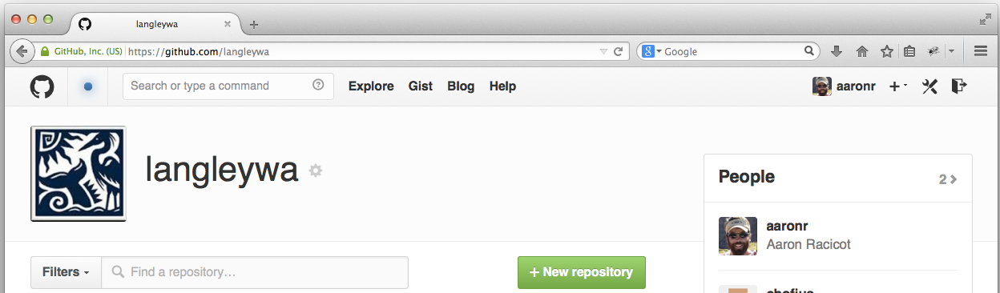

<!------------------------------------------------------------>
<!--      FOSS4G 2014 - Small Town GIS leveraging GitHub    -->
<!--      Target talk time - 20 min + 5 min questions       -->
<!------------------------------------------------------------>

<!------------------------------------------------------------>
<!-- Topic: Title slide -->

<h2>Small Town GIS leveraging GitHub</h2>

    <small>Aaron Racicot - <a href="mailto:aaronr@z-pulley.com">aaronr@z-pulley.com</a>
 
<a href="http://reprojected.com">reprojected.com</a> / <a href="http://twitter.com/reprojected">@reprojected</a> 
 
<a href="https://github.com/aaronr">github.com/aaronr</a>
  
<a href="http://aaronr.github.io/foss4g-2014/smalltown">aaronr.github.io/foss4g-2014/smalltown</a>
</small>

<!------------------------------------------------------------>
--SLIDE--
<!-- Topic: Introduce myself -->

<h1>Who I am?</h1>

<ul>
  <li><strong>SW Developer</strong></li>
  <li><strong>Environmental Scientist</strong></li>
  <li><strong>Open Source Advocate</strong></li>
</ul>

--SUBSLIDE--

  <h3>Computer Science</h3>
  <h2>Bridging the Gap</h2>
  <h3>Environmental Science</h3>

--SUBSLIDE--

<!------------------------------------------------------------>
--SLIDE--
<!-- Topic: Target Audience -->

Define small town...

--SUBSLIDE--

Our small town...

--SUBSLIDE--

What our small town needs...

<!------------------------------------------------------------>
--SLIDE--
<!-- Topic: GitHub ... -->

GitHub
Version Control
Open at heart

--SUBSLIDE--

Types of accounts...

--SUBSLIDE--

Using GH Pages as a resource

<!------------------------------------------------------------>
--SLIDE--
<!-- Topic: Geo at GitHub -->

Geo at Github

--SUBSLIDE--

Preview GeoJSON

--SUBSLIDE--

Diff GeoJSON

<!------------------------------------------------------------>
--SLIDE--
<!-- Topic: Bring the two together -->

Leverage GitHub for your small town

--SUBSLIDE--

Minimum::
- Store your geo-data
- Use it to view datasets

--SUBSLIDE--

Medium::
- Build Apps around it

--SUBSLIDE--

Max It::
- Edit data via geojson.io
- Store tilesets???

<!------------------------------------------------------------>
--SLIDE--
<!-- Topic: How we started -->

ClaireH internship

<!------------------------------------------------------------>
--SLIDE--
<!-- Topic: Examples -->

Data Download App

--SUBSLIDE--

Water Meter App

<!------------------------------------------------------------>
--SLIDE--
<!-- Topic: Where we want to go -->

Generate full blown GIS workflow based on free resources

<!------------------------------------------------------------>
--SLIDE--
<!-- Topic: Thank You -->

<h1>Thank You !!!</h1>

